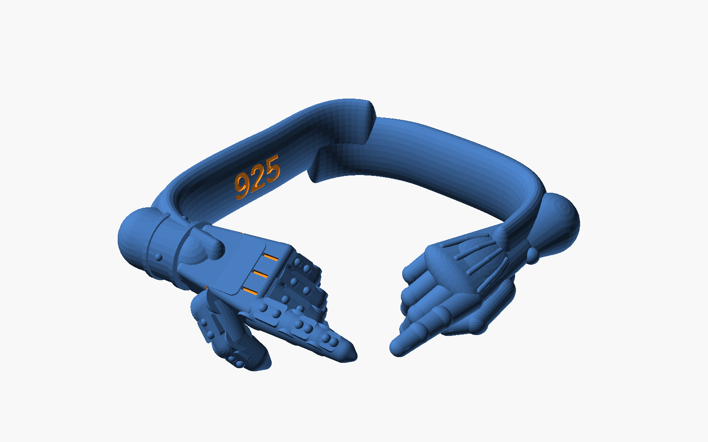
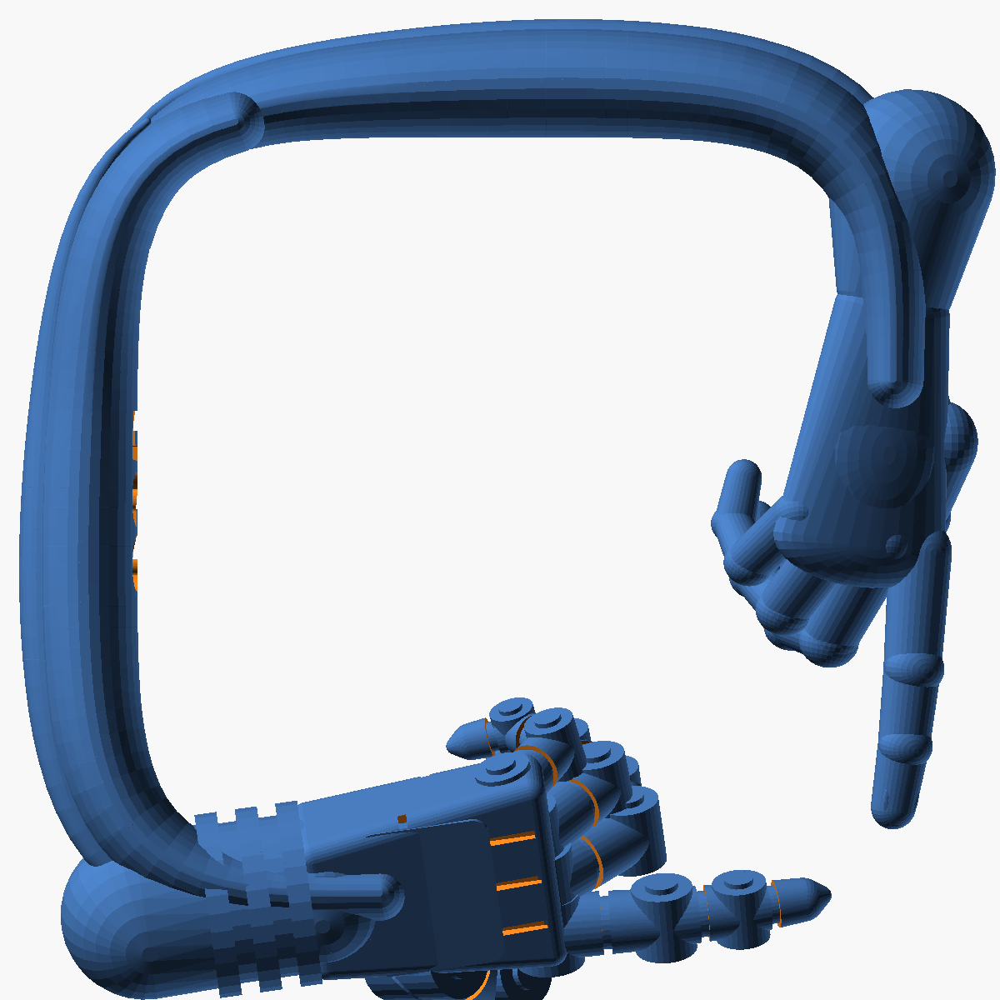
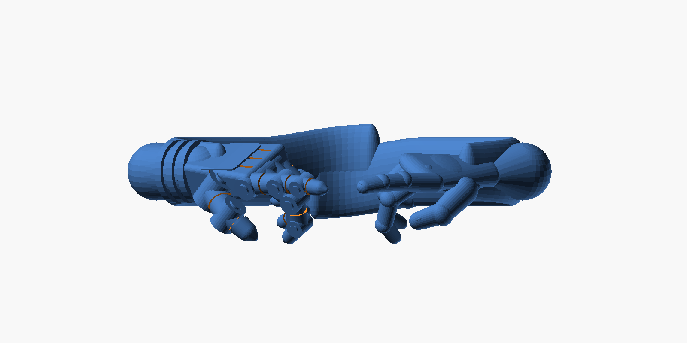

# Creation Cuff & Creation Ring — parametric CAD templates

Two pieces built from the same pair of hands: a **segmented robotic left hand**
and an **organic human right hand** reaching for each other, index fingers
almost touching — the *Creation of Adam* gesture.

* **Creation Ring** (`creation_ring.scad`) — a rounded-square ring whose band
  is the two forearms: flat and engraved inside, muscular outside, crossing at
  the back corner. The hands run along two adjacent sides and meet at the
  front corner; the fingers droop below the band. Modelled after the silver
  S925 ring reference, with the left hand swapped for the robot's.
* **Creation Cuff** (`creation_cuff.scad`) — an open band whose ends become
  the wrists, from which the hands reach across the opening. The `bangle`
  preset is the hammered round cuff with a bulb at each end; the `ring`
  preset is the wide, planished flat band where the human forearm *is* the
  band and the robot hand grows out of a collared bulb.

| Creation Ring | Ring, top | Ring, side |
|---|---|---|
|  |  |  |

| Cuff, bangle preset | Cuff, ring preset |
|---|---|
|  |  |

| Cuff, top | Cuff, front |
|---|---|
|  |  |

## Files

| File | What it is |
|---|---|
| `creation_ring.scad` | The rounded-square ring. Open in [OpenSCAD](https://openscad.org) (free). |
| `creation_cuff.scad` | The open bangle / round ring. |
| `hands.scad` | The two hands, shared by both models (`use <hands.scad>`). |
| `Makefile` | `make` regenerates every STL and preview below. |
| `export/creation_ring.stl` | Ring, one solid piece (inner 17.3 mm across flats ≈ US 7). |
| `export/creation_ring_band.stl` | Ring band (both arms) only, for separate casting. |
| `export/creation_ring_human_hand.stl` | Ring's human hand only, wrist at the origin, fingers along +X. |
| `export/creation_ring_robot_hand.stl` | Ring's robot hand only, same frame. |
| `export/creation_cuff_bangle.stl` | Wrist cuff, one solid piece (inner Ø 62 mm). |
| `export/creation_cuff_ring.stl` | Finger ring, one solid piece (inner Ø 17.3 mm ≈ US size 7). |
| `export/creation_cuff_bangle_band.stl` | Band only, for casting the pieces separately. |
| `export/creation_cuff_bangle_human_hand.stl` | Human hand only, wrist at the origin, fingers along +X. |
| `export/creation_cuff_bangle_robot_hand.stl` | Robot hand only, same frame. |

All meshes are watertight single solids in millimetres, ready for resin
printing / lost-wax casting or import into Rhino, Fusion, Blender, etc.

## Creation Ring knobs

Everything lives in the *Customizer* panel of OpenSCAD (Window → Customizer),
or can be set from the shell with `-D`:

```sh
openscad -o my_ring.stl -D '$fn=64' -D inner_d=18.1 -D 'inner_text="S925"' creation_ring.scad
```

| Parameter | Default | Meaning |
|---|---|---|
| `part` | `"assembly"` | `"band"`, `"human_hand"`, `"robot_hand"` export one piece |
| `inner_d` | 17.3 | Inside size across the flats (see the ring-size chart) |
| `band_w` | 4.8 | Axial width of the band, how tall it sits on the finger |
| `band_t` | 1.5 | Radial thickness at the wrists, the thinnest point |
| `arm_bulge` | 2.6 | Radial thickness at the belly of each forearm |
| `squareness` | 4.5 | Corner shape: 2 is a circle, 4 a squircle, 6 nearly square |
| `tip_gap` | 0.9 | Space left between the two index fingertips |
| `finger_thickness` | 1.2 | Multiplier on finger diameters, for castability |
| `wrist_shift` | 20° | How far past the wrist corners the hands start; bigger = shorter hands |
| `hand_roll` | 28° | Back of each hand tilted outward from the ring axis |
| `hand_pitch` | 0° | Droop of the whole hand below the band plane |
| `hand_yaw_in` | 8° | Each hand aimed inward so the index tips converge at the corner |
| `finger_curl` | 1.0 | Scales how tightly the three tucked fingers curl |
| `inner_text` | `"925"` | Engraved on the inside of the left side, empty for none |
| `text_depth` | 0.15 | Engraving depth |
| `tendons` | true | Tendon ridge along the back of each forearm |
| `cross_offset` | 0.9 | Axial offset of the two arms where they cross at the back |
| `$fn` | 32 | Facets per circle; 48–64 for the final export |

The band's inner face is a true superellipse of `inner_d` across the flats;
the muscle swells grow outward only, so sizing is unaffected by them. Hand
length is derived from the corner-to-wrist distance, so a bigger ring gets
bigger hands automatically.

## Creation Cuff knobs

```sh
openscad -o my_cuff.stl -D '$fn=48' -D 'preset="custom"' \
         -D custom_inner_diameter=58 -D custom_gap_angle=90 creation_cuff.scad
```

| Parameter | Bangle | Ring | Meaning |
|---|---|---|---|
| `preset` | `"bangle"` | `"ring"` | `"custom"` uses the `custom_*` values below |
| `part` | `"assembly"` | | `"band"`, `"human_hand"`, `"robot_hand"` export one piece; `"hands"` both hands in place without the band |
| `custom_inner_diameter` | 62 | 17.3 | Inside diameter at the thin back of the band |
| `custom_band_thickness` | 5 | 2.7 | Radial thickness of the band at the back |
| `custom_band_width` | 5 | 2.9 | Axial width of the band at the back (equal to thickness for a round band) |
| `custom_band_swell` | 8 | 3.3 | Diameter of the bulb the robot hand grows out of |
| `custom_human_end` | `"bulb"` | `"forearm"` | Human side ends in a matching bulb, or the band tapers into the forearm |
| `custom_dimples` | 0 | 96 | Hammer marks planished into the outside of the band (each is a boolean, so they cost render time) |
| `dimple_size`, `dimple_depth` | 1.0, 0.2 | | Dimple radius and depth as fractions of the band's radial half-thickness |
| `custom_gap_angle` | 95° | 116° | Opening between the band ends; the hands are sized to fill it |
| `custom_tip_gap` | 3 | 0.8 | Space left between the two fingertips |
| `custom_finger_thickness` | 1.0 | 1.15 | Multiplier on finger diameters; the ring's human fingers are about 1 mm like the reference, the robot's are 1.25× stouter |
| `wrist_bend` | 0.7 | | 0 = hands continue the band's curve, 1 = they point straight across; the hands are lengthened so the tips still meet |
| `hand_pitch` | 8° | | Droop of the hands below the band plane |
| `hand_roll` | 0° | | Twist of each hand about its forearm |
| `finger_curl` | 1.4 | | Scales how tightly the three tucked fingers curl |
| `swell_span` | 45° | | Length of band, per side, over which it fattens into the wrist |
| `hammer` | 0.08 | | Soft organic undulation of the band's outer surface, as a fraction of its radius (0 = perfectly even) |
| `$fn` | 28 | | Facets per circle; use 48–64 for the final export |

The hands are **derived**: each one heads out along the band's tangent, bent
toward the chord by `wrist_bend`, and is made exactly long enough for the two
index tips to meet on the centre plane `tip_gap` apart. Changing the diameter,
gap or bend re-sizes and re-aims them automatically. The console prints the
hand length and the thinnest feature (pinky tip) and warns when that drops
under 0.6 mm, the floor most casters accept for silver.

### Ring sizes

Set `custom_inner_diameter` to the inside diameter of the size you need:

| US | 5 | 6 | 7 | 8 | 9 | 10 | 11 |
|---|---|---|---|---|---|---|---|
| Ø mm | 15.7 | 16.5 | 17.3 | 18.1 | 18.9 | 19.8 | 20.6 |

The inner face is a true circle of that diameter all the way round; the swell
grows outward only, so the fit is not affected by it.

## How the models are built

* **Ring band** — two sweeps of hulled ellipsoids along a superellipse
  (`|x/a|^n + |y/a|^n = 1`), one per arm, each thickening to a belly and
  thinning to the wrist, with a tendon ridge along the outside. The inner
  bore is subtracted afterwards so the inside is a flat, engravable face.
  The arms drift apart axially as they approach the back corner so they read
  as crossing.
* **Cuff band** — a sweep of hulled ellipsoids around an arc of `360 − gap`
  degrees. The profile (radial × axial) smooth-steps from the back section to
  each end section: a round bulb on the robot side, a bulb or a slimmer
  forearm on the human side. The outer surface carries a smooth,
  low-frequency undulation (`hammer`) and, on the ring preset, planished
  hammer marks: shallow spheres subtracted in three staggered rows, each
  seated on the oval profile's surface normal. Because the centres sit at
  `inner_radius + r`, the bore stays perfectly round.
* **Human hand** — wrist and palm are hulled ellipsoids with a metacarpal dome,
  a thenar pad, a wrist bone and four extensor tendons seated on the back;
  each finger is a recursive chain of hulled, slightly flattened spheres with
  per-joint flexion and a nail on the index and thumb.
* **Robot hand** — a wide riveted collar, ball wrist, a tapered rounded-box
  palm with panel grooves and a raised back plate, a short pin at every
  knuckle, and fingers made of tapered tubes each wearing an armour plate
  with two rivets on its back.
* **Posing** — both hands share one frame (wrist at origin, fingers +X, thumb
  +Y, back of hand +Z). Each hand is yawed to point at the meeting point and
  the left hand is mirrored so it is a true left hand. On the ring the hands
  are additionally rolled so the backs face outward and the fingers droop
  down and inward, as in the reference.

## Exporting other formats

* **STEP / IGES** for a solid-modelling CAD package: open the STL in FreeCAD
  (Part → Create shape from mesh → Convert to solid → Export) or use the
  *Import Mesh* + *Mesh to BRep* tools in Fusion 360. The model is a
  faceted solid by nature, so bump `$fn` before doing this.
* **3MF / OBJ**: OpenSCAD exports these directly (`-o file.3mf`).

## Implicit model (smoothest version)

`implicit/` holds the same ring as a signed-distance field built with the
[text-to-cad](https://github.com/earthtojake/text-to-cad) `implicit-cad`
skill. Every part is a smooth blend (`implicit_union_round`) of capsules,
ellipsoids and spheres, so the surface is continuous everywhere: no boxes,
no plates, no capsule at the wrist, and the band flows straight into each
hand. It exports as one watertight mesh.

| File | What it is |
|---|---|
| `implicit/parts/params.mjs` | Shared dimensions, hand placement (tangent bent toward the chord) and a small pose solver (`fingerChain`) |
| `implicit/parts/band.mjs` | Oval-section torus arc with planished hammer marks (jittered, rotated hex lattice of dimples on the outer face) |
| `implicit/parts/human_hand.mjs`, `robot_hand.mjs` | The two hands in a shared local frame (wrist at the origin, fingers +X, thumb +Y, back +Z) |
| `implicit/build_model.mjs` | Assembles `creation_ring.implicit.js` (or a single-part test model) |
| `implicit/test_part.sh` | Build, mesh and render one part or the whole ring in silver |
| `export/creation_ring_implicit.stl`, `.3mf` | The meshed ring |

```sh
make implicit            # mesh at resolution 220 (about 0.1 mm), plus 3MF
cd implicit && ./test_part.sh all 150   # quick build + silver renders in implicit/review/all
```

Open `implicit/creation_ring.implicit.js` in the text-to-cad CAD Viewer to
raymarch it live; it needs no mesh.

## Matching the reference

The ring preset was tuned by rendering the model in silver from the photo's
angle and comparing side by side, four rounds: band girth and section,
hammer depth, how directly the hands aim across the opening, fist tightness,
finger gauge (human about 1 mm, robot stouter). Re-run that loop after any
change with `part="band"` and `part="hands"` exported in parallel at a low
`$fn`; the two STLs concatenate straight into a viewer.

## Regenerating

```sh
cd cad/creation_cuff
make            # all STLs and PNGs, $fn=36
make FN=64 stl  # higher-resolution meshes only
make export/creation_ring.stl   # just the ring
```
