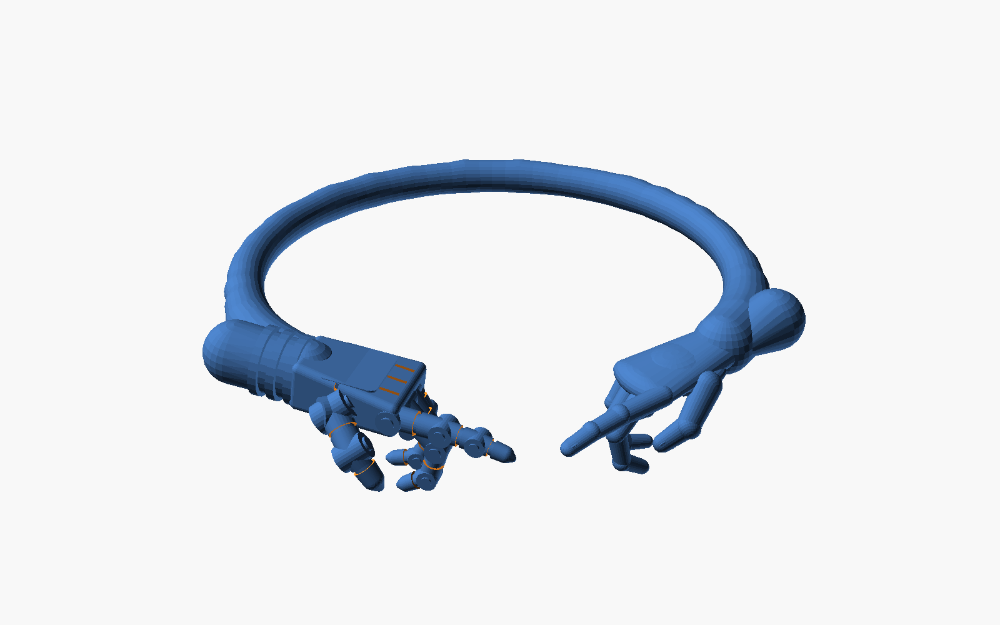
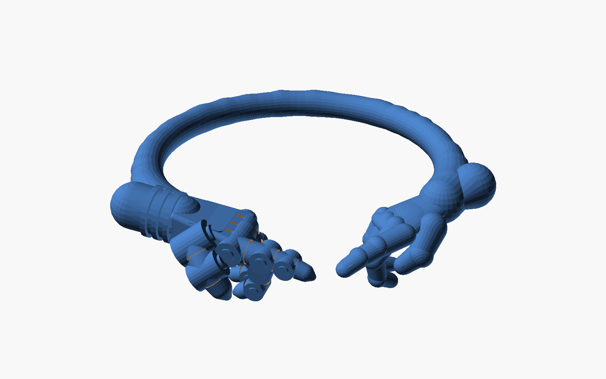
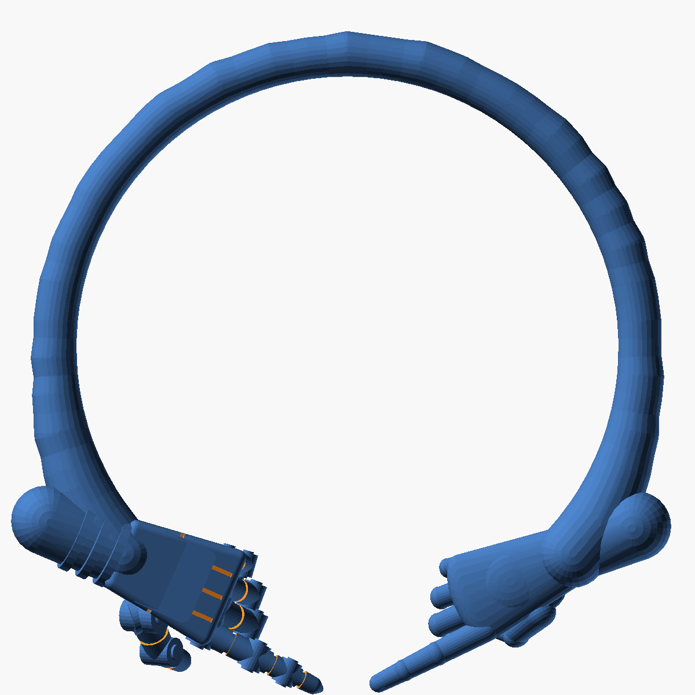
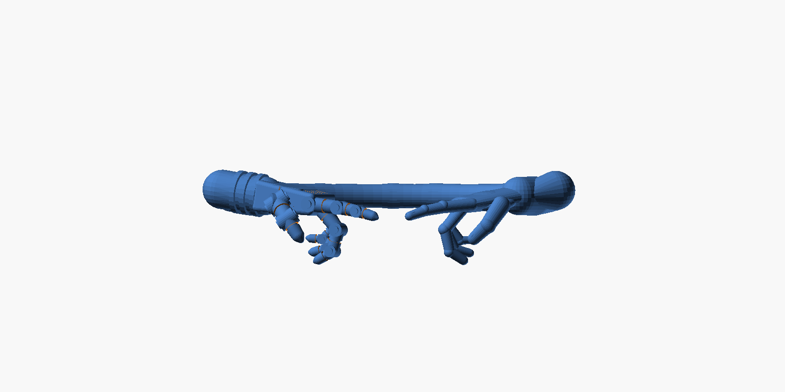

# Creation Cuff — parametric CAD template

An open round band whose two ends swell into wrists, from which a **segmented
robotic hand** (left) and an **organic human hand** (right) reach toward each
other across the opening, index fingers almost touching — the *Creation of
Adam* gesture. Modelled after the silver bangle reference photo.

| Bangle preset | Ring preset |
|---|---|
|  |  |

| Top | Front |
|---|---|
|  |  |

## Files

| File | What it is |
|---|---|
| `creation_cuff.scad` | The whole model, fully parametric. Open in [OpenSCAD](https://openscad.org) (free). |
| `Makefile` | `make` regenerates every STL and preview below. |
| `export/creation_cuff_bangle.stl` | Wrist cuff, one solid piece (inner Ø 62 mm). |
| `export/creation_cuff_ring.stl` | Finger ring, one solid piece (inner Ø 17.3 mm ≈ US size 7). |
| `export/creation_cuff_bangle_band.stl` | Band only, for casting the pieces separately. |
| `export/creation_cuff_bangle_human_hand.stl` | Human hand only, wrist at the origin, fingers along +X. |
| `export/creation_cuff_bangle_robot_hand.stl` | Robot hand only, same frame. |

All meshes are watertight single solids in millimetres, ready for resin
printing / lost-wax casting or import into Rhino, Fusion, Blender, etc.

## Presets and knobs

Everything lives in the *Customizer* panel of OpenSCAD (Window → Customizer),
or can be set from the shell with `-D`:

```sh
openscad -o my_cuff.stl -D '$fn=48' -D 'preset="custom"' \
         -D custom_inner_diameter=58 -D custom_gap_angle=90 creation_cuff.scad
```

| Parameter | Bangle | Ring | Meaning |
|---|---|---|---|
| `preset` | `"bangle"` | `"ring"` | `"custom"` uses the `custom_*` values below |
| `part` | `"assembly"` | | `"band"`, `"human_hand"`, `"robot_hand"` export one piece |
| `custom_inner_diameter` | 62 | 17.3 | Inside diameter at the thin back of the band |
| `custom_band_thickness` | 5 | 1.9 | Diameter of the round band profile at the back |
| `custom_band_swell` | 8 | 2.8 | Band profile diameter where it swells into the wrists |
| `custom_gap_angle` | 95° | 100° | Opening between the band ends; the hands are sized to fill it |
| `custom_tip_gap` | 3 | 0.8 | Space left between the two fingertips |
| `custom_finger_thickness` | 1.0 | 1.6 | Multiplier on finger diameters, for castability at small scale |
| `meet_inset` | 0 | | Move the meeting point inward from the band circle |
| `hand_pitch` | 8° | | Droop of the hands below the band plane |
| `hand_roll` | 0° | | Twist of each hand about its forearm |
| `finger_curl` | 1.0 | | Scales how tightly the three tucked fingers curl |
| `swell_span` | 45° | | Length of band, per side, over which it fattens into the wrist |
| `hammer` | 0.05 | | Hammered relief on the outside of the band, as a fraction of band radius (0 = smooth) |
| `$fn` | 28 | | Facets per circle; use 48–64 for the final export |

The hands are **derived**: their length is the distance from the band end to
the meeting point minus half the tip gap, so changing the diameter or gap
re-sizes and re-aims them automatically. The console prints the hand length
and the thinnest feature (pinky tip) and warns when that drops under 0.8 mm.

### Ring sizes

Set `custom_inner_diameter` to the inside diameter of the size you need:

| US | 5 | 6 | 7 | 8 | 9 | 10 | 11 |
|---|---|---|---|---|---|---|---|
| Ø mm | 15.7 | 16.5 | 17.3 | 18.1 | 18.9 | 19.8 | 20.6 |

The inner face is a true circle of that diameter all the way round; the swell
grows outward only, so the fit is not affected by it.

## How the model is built

* **Band** — a sweep of hulled spheres around an arc of `360 − gap` degrees.
  The sphere radius follows a smooth-step from `band_thickness/2` at the back
  to `band_swell/2` at each end, and a seeded random jitter gives the
  hammered surface. Because the sphere centres sit at `inner_radius + r`, the
  bore stays perfectly round.
* **Human hand** — wrist and palm are hulled ellipsoids with a metacarpal dome
  and a thenar pad; each finger is a recursive chain of hulled, slightly
  flattened spheres with per-joint flexion and a nail on the index and thumb.
* **Robot hand** — bellows collar, ball wrist, a tapered rounded-box palm with
  panel grooves and a raised back plate, pinned knuckle joints, and fingers
  made of tapered tubes with washers at each pin and a groove on each phalanx.
* **Posing** — both hands share one frame (wrist at origin, fingers +X, thumb
  +Y, back of hand +Z). The right hand is yawed to point at the meeting point;
  the left hand is mirrored so both thumbs face the wearer's front.

## Exporting other formats

* **STEP / IGES** for a solid-modelling CAD package: open the STL in FreeCAD
  (Part → Create shape from mesh → Convert to solid → Export) or use the
  *Import Mesh* + *Mesh to BRep* tools in Fusion 360. The model is a
  faceted solid by nature, so bump `$fn` before doing this.
* **3MF / OBJ**: OpenSCAD exports these directly (`-o file.3mf`).

## Regenerating

```sh
cd cad/creation_cuff
make            # all STLs and PNGs, $fn=36
make FN=64 stl  # higher-resolution meshes only
```
